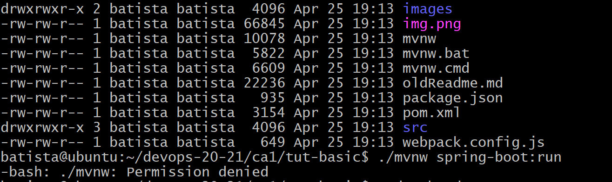
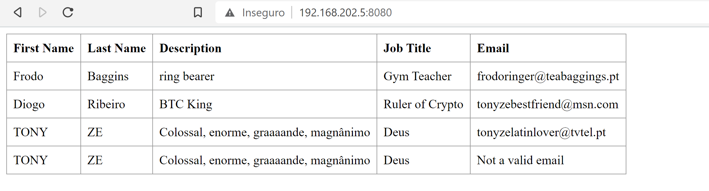
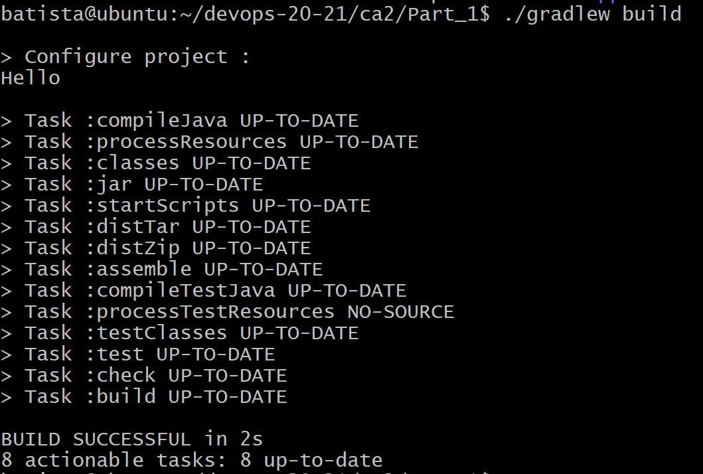
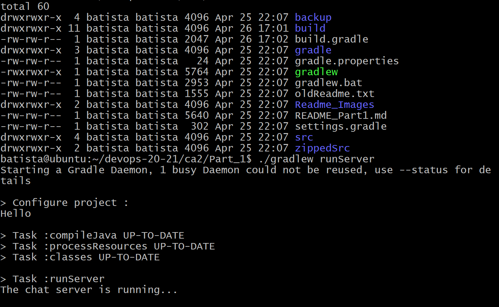
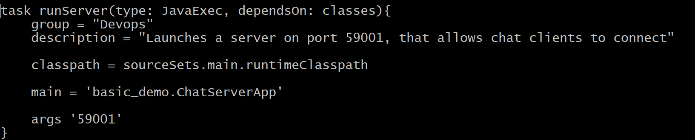
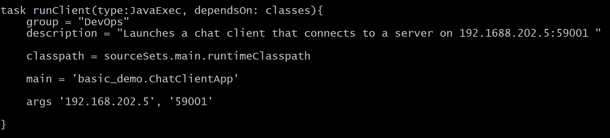
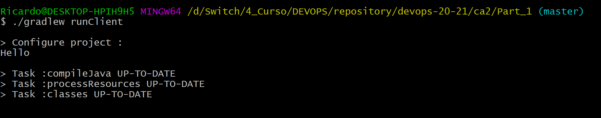
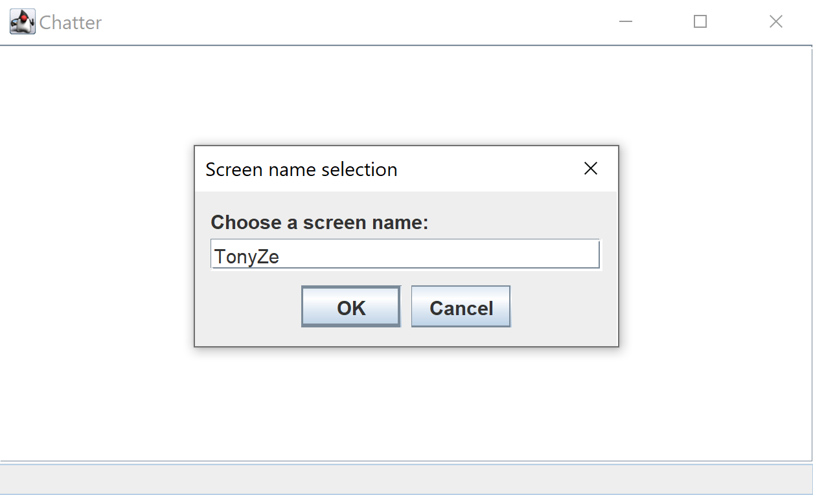

# Class Assignment 3 - Part 1

# Virtualization Tutorial

Hello and welcome back to the "Learn things by following other things I say" series!  

Today we will be working with Virtualization! I know some of you already virtualize many things like friends, happiness, girlfriends,... but today we will be doing a Software Virtualization Tutorial.

Software Virtualization allows you to virtualize (From the creators of "A compiler, compiles and a computer, computes") different simulated hardwares running in your real hardware. 

This way you can have several machines inside your machine, running different OS and applications.

# 1. Create a VM

**1.1.** Follow the instructions provided in the Devops lecture in order to set up your VM using VirtualBox.

# 2. Clone your repository

**2.1.** Start your VM and open a command line (You can login through SSH to your VM: _ssh username@address_)

**2.2.** Go to your Bitbucket repository and clone it to your VM using _git clone < repository url >_

# 3. Build and Execute previous Class Assignments

**3.1.** In the command line, navigate to your repository directory and go to CA1 folder.

**3.2.** Execute the application running _./mvnw spring-boot:run_

**3.3.** Something like this can happen:

**If a "permission denied" message appears, well that's it. You can pack your bags and go home...Nothing to do.**

Just kidding.

 **Add an execution permission to the "user" group in the mvnw file. (_sudo chmod u+x mvnw_)**

**3.4.** Run _./mvnw spring-boot:run_ again.

**3.5.** Spring Boot should now be up and running. 

   Try to see the Front-End results by opening your browser and verifying if the expected values are there.  

   Your browser address should be your configured IP address from the Virtual Machine followed by the 8080 port (Example: 192.168.202.5:8080)

**3.6.** Now let's see CA2 Part1. Use the command line to navigate to the CA2_PART1 directory in your VM.

**3.7.** Try to build the project using _./gradlew build_ (Check **3.3** if you're having problems with permission)

It should compile and look something like this:

**3.8.** Now, let's try to run the server and use the chat client.

Since our Virtual Machine has an OS that doesn't have a Graphics User Interface we cannot use the chat client inside the VM.

This way, if you want to interact with the chat client you have to initiate the server in your VM and then run the chat client in your host.

So, in your VM navigate to your ca2_part1 folder and run the server _./gradlew runServer_

The server is now running. You can now access to the FBI's server motherbase mainframe network.

**3.9.** In order to guarantee that the client is accessing your VM's server, you have to make sure the server, and the client, are using the same port.

Stop the server if it's running and in your VM verify the _build.gradle_ file and confirm the port used as an argument in the task _runServer_ (Use _nano build.gradle_ to edit/view the content):

Great. So, run the server in your VM and open another command line in your host machine. 

Navigate through the folder and check the _build.gradle_ file. 

In case you don't know what to do just read the previous paragraph and verify if the **runClient** task has the same defined port and verify if the host address is the IP you have previously configured in your VM.

Perform the necessary changes in order to guarantee the correct address and port, save the changes and let's execute the client: _./gradlew runClient_

A pop-up should now appear

That's it. You can now chat with all your friends! Yeah, it's probably just you...we don't judge.

## Congratulations! You just unlocked a new achievement called _More work!_

Stay tuned for more!

