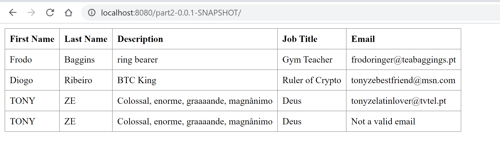
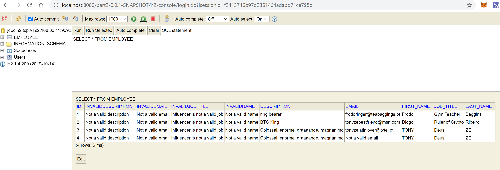

# Class Assignment 3 - Part 2

# Virtualization - Vagrant

We're here again old friend!

We'll be talking about Vagrant as way to easily manage multiple Virtual Machines.

Glad to see that when you are in despair, you come to me!

## This is you before the tutorial:


## This will be you after this tutorial:


# 1. View repository

Go to https://bitbucket.org/atb/vagrant-multi-spring-tut-demo/ and take a look to the Readme file.

# 2. Study the Vagrantfile in order to understand how it is used to create and provision 2 VMs


# 3. Copy the Vagrantfile to your working directory

This one is easy. 

Just copy the file to your working directory. 

This will be the file that will configure your Virtual
Machines.

We'll get back here in a while.

# 4. Copy CA2 Part 2 and make some adjustments to your project

4.1. Create a copy of your CA2_Part2 project in your working directory.

4.2. Now let's go to another repository (https://bitbucket.org/atb/tut-basic-gradle/src/master/) and see all the
necessary changes to our project. In order to do this let's check the commits.

4.3. After viewing all the necessary changes let's apply them to our project.  

**4.4. Go to the _build.gradle_ file and add support to build war files. (Be careful not to pronounce war loudly or you may just attract some americans and their _freedom_.)**

**4.4.1. Add _id 'war'_ in the _plugins_ section.**

```groovy
plugins {
    id 'org.springframework.boot' version '2.4.4'
    id 'io.spring.dependency-management' version '1.0.11.RELEASE'
    id 'java'
    id "org.siouan.frontend" version '1.4.1'
    id 'war'
}
```

**4.4.2. Add _providedRuntime 'org.springframework.boot:spring-boot-starter-tomcat'_ to the dependencies section in the same
file.**

```groovy
dependencies {
    implementation 'org.springframework.boot:spring-boot-starter-data-jpa'
    implementation 'org.springframework.boot:spring-boot-starter-data-rest'
    implementation 'org.springframework.boot:spring-boot-starter-thymeleaf'
    implementation 'org.testng:testng:7.1.0'
    implementation 'org.junit.jupiter:junit-jupiter:5.7.0'
    runtimeOnly 'com.h2database:h2'
    testImplementation 'org.springframework.boot:spring-boot-starter-test'
    providedRuntime 'org.springframework.boot:spring-boot-starter-tomcat'
}
```

**4.4.3. Create the _ServletInitializer.java_ Class (in the same package with all the other java Classes) with the following code:**

```java
package com.greglturnquist.payroll;

import org.springframework.boot.builder.SpringApplicationBuilder;
import org.springframework.boot.web.servlet.support.SpringBootServletInitializer;

public class ServletInitializer extends SpringBootServletInitializer {

    @Override
    protected SpringApplicationBuilder configure(SpringApplicationBuilder application) {
        return application.sources(ReactAndSpringDataRestApplication.class);
    }

}
```

**4.5. Add support for the h2 console and settings for remote h2 database.**

Basically let's sum up 4 commits into one and add the following lines to the _application.properties_ file:

```groovy
server.servlet.context-path=/part2-0.0.1-SNAPSHOT
spring.data.rest.base-path=/api
#spring.datasource.url=jdbc:h2:mem:jpadb
# In the following settings the h2 file is created in /home/vagrant folder
spring.datasource.url=jdbc:h2:tcp://192.168.33.11:9092/./jpadb;DB_CLOSE_DELAY=-1;DB_CLOSE_ON_EXIT=FALSE
spring.datasource.driverClassName=org.h2.Driver
spring.datasource.username=sa
spring.datasource.password=
spring.jpa.database-platform=org.hibernate.dialect.H2Dialect
# So that spring will not drop (the Beat??) the database on every execution.
spring.jpa.hibernate.ddl-auto=update
spring.h2.console.enabled=true
spring.h2.console.path=/h2-console
spring.h2.console.settings.web-allow-others=true
```

Notice that the first line contains a path which is specific to the project. You can find this path in the _settings.gradle_. The _-0.0.1-SNAPSHOT_ should be common regardless of the project's name.

**4.6. Modify the application context path to match the one from your project.**

Use the last sentence from the previous instruction to verify the path name to use.

Now go to the _app.js_ file, and change the _path_ on the client part of the _componentDidMount()_, according to your project:

```javascript
componentDidMount() { // <2>
client({method: 'GET', path: '/part2-0.0.1-SNAPSHOT/api/employees'}).done(response => {
this.setState({employees: response.entity._embedded.employees});
});
}
```

Make sure it matches the one from the _application.properties_ file (_server.servlet.context-path=/part2-0.0.1-SNAPSHOT_).


**4.7. Remove the** 

  
**from the _index.html_ file**

Go to the _index.html_ file and remove the / before "main.css" from line 6:

```html
<link rel="stylesheet" href="main.css" />
```

# 5. Update the remote repository and edit the Vagrantfile

**5.1.** Commit and push all the changes to your remote repository.

**5.2.** Now, let's get back to our Vagrantfile. We are going to make some changes so that the Virtual Machines we're going to initialize, can copy our repository and execute things from such location.

**5.3.** Open the Vagrantfile and go to the web.vm.provision.We're going to change lines 70, 71 and 75.

**Line 70 - change it to your repository:**

```git clone https://Batista_Ricardo@bitbucket.org/Batista_Ricardo/devops-20-21.git```

**Line 71 - change it to the folder where your gradlew file will be. Otherwise Gradle won't be able to build the project:**

```cd devops-20-21/ca3/Part2/demo```

**Line 75 - Change the path of your war file to the correct name (in this example part2-0.0.1-SNAPSHOT.war):**

```sudo cp ./build/libs/part2-0.0.1-SNAPSHOT.war /var/lib/tomcat8/webapps```

# 6. We're all set to initialize the VM's

**6.1.** Open a command line in your Vagrantfile location and type _vagrant up_

**6.2.** Now rejoice and see what a dev you are...all that black screen and white letters. Imagine showing it to your friends (if you had any...). You feel like everything is going well, and then _Fortunate Son_ starts playing, the bushes start speaking vietnamese and you start to relieve your nightmares...It's BAZEL all over again...


Build is failing! Task _frontendAssemble_ is not working, webpack permission denied, E = mc2,  and many other things I couldn't understand.

I try to run the build in my host machine, and it builds with success. So it must be an issue with the repository and/or the VM.

**I've tried the following steps:**

**1.** Verified the repository to see if all files were there.


**2.** Sent some files that could be missing and changed the gitignore.  


**3.** Used PDD (Pedreiro Driven Design) to remove folders and substitute them by changing names and adding them again.  


**4.** Prayed


**5.** Removed files that were sent by mistake.


**6.** Went to StackOverflow and stayed even more confused with the answers.


**7.** Uninstalled vagrant and installed vagrant again.


**8.** Deleted system32


**9.** Joined a Forex group


**10.** Thinked about an alternative using a synchronized folder instead of a git clone (This was actually tested after and it would have worked).


**11.** 


I knew it was time to call for help, so I lit the beacons of Grupo 3.


I was badly injured but thankfully my teammates carried me to safety (Specially Bruno Tamames!)


So in summary, you have to make sure that the **node** and **node_modules** folders from your project are not sent to your remote repository! Remove them from the repository and add them to the gitignore.

Since my host machine is Windows and the VM is Linux there was a conflict in the files generated by the VM because of the mixture with the wrongfully placed Windows files in the repository.

In alternative to delete folders from your remote repository, you can add an extra step to the _web.vm.provision_ in order to delete this folders if they are already in the Virtual Machine, before executing the _./gradlew clean build_:

```
 # Change the following command to clone your own repository!
      git clone https://Batista_Ricardo@bitbucket.org/Batista_Ricardo/devops-20-21.git
      cd devops-20-21/ca3/Part2/demo
      chmod u+x gradlew
      
      rm -r node
      rm -r node_modules
      
      ./gradlew clean build
      # To deploy the war file to tomcat8 do the following command:
      sudo cp ./build/libs/part2-0.0.1-SNAPSHOT.war /var/lib/tomcat8/webapps
```

Finally, at peace:


# 7. Verify FrontEnd and H2

**7.1.** Make sure your VM's are running (_vagrant up_ or _vagrant reload --provision_) and type http://localhost:8080/part2-0.0.1-SNAPSHOT/ in your browser.

You should see your table of Employees



**7.2.** Type _http://localhost:8080/part2-0.0.1-SNAPSHOT/h2-console_ to view the Database.

**7.3.** Copy the _jdbc:h2:tcp://192.168.33.11:9092/./jpadb;DB_CLOSE_DELAY=-1;DB_CLOSE_ON_EXIT=FALSE_ from the application.properties file (_spring.datasource.url_) and paste it in the JDBC URL that appears on the h2-console login.

Then, verify your data in the Employee table




# 8. That's it! We've suffered to reach the end. Now we know how Sporting fans feel!
