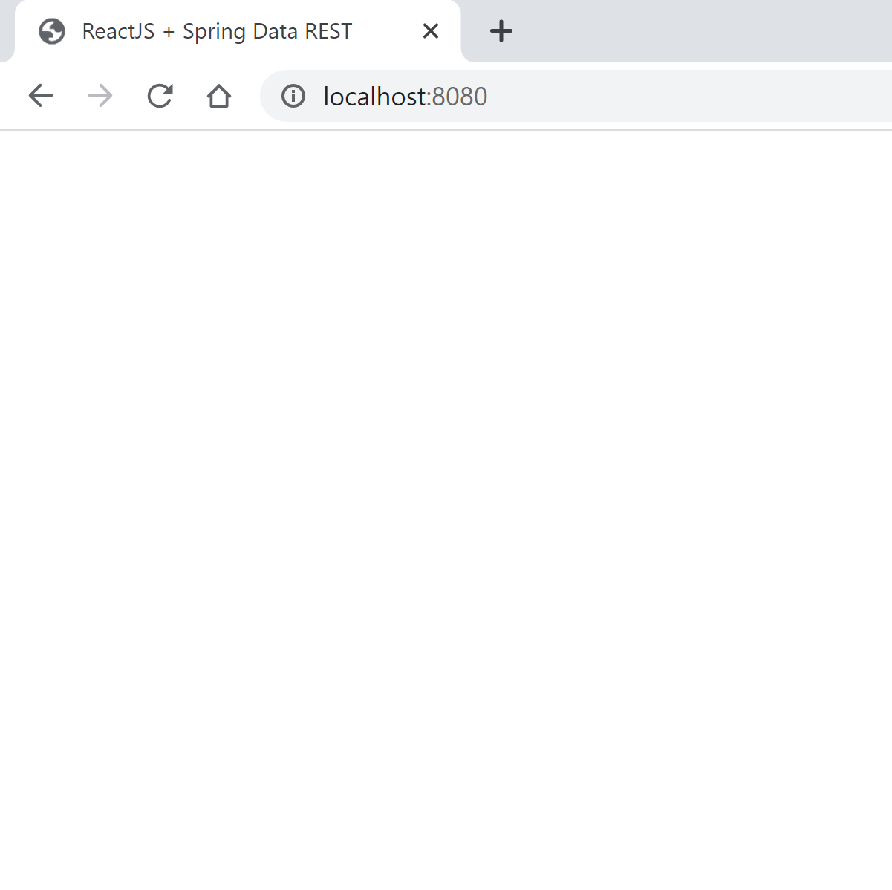

# Gradle Tutorial - Class Assignment 2 - Part 2

In this tutorial we are going to complete the second part of Class Assignment 2. 

# 1. Create a _tut-basic-gradle_ branch

1.1 Open the command line in your desired working directory and create a new branch called tut-basic-gradle (_git checkout -b tut-basic-gradle_)

# 2. Create a Spring-Boot project with Gradle

2.1 Go to https://start.spring.io/

2.2 Create a Spring project, selecting _Gradle Project_ and adding the following dependencies: Rest Repositories, Spring Data JPA, H2 Database and Thymeleaf


2.3 Click Generate, unzip the file and copy the content to your working directory.

2.4. Use _./gradlew tasks_ in the command line to view the available tasks.

# 3. Delete the src folder

3.1 Delete the src folder in your working directory. Do not fear, TonyZe is here to guide you! We're going to use the one from the tut-basic.

# 4. Copy src folder from tut-basic

4.1 Copy the src folder from CA1 (tut-basic) and paste it in your working directory.

4.2 Copy the _webpack.config.js_ and _package.json_ to the working directory.

4.3 Delete the folder _src/main/resources/static/built/_. This folder should now be generated from the Javascript by the tool webpack.

# 5. Run the application

5.1 Run the application with _./gradlew bootRun_

5.2 Go to your browser and type _localhost:8080_. You should only see this:



The next step is going to be the adding of the frontend plugin.

# 6. Add the org.siouan.frontend plugin

6.1 In the build.gradle file, paste the following 

```java
id "org.siouan.frontend" version "1.4.1"
```

6.2 Add the following code to configure the previous plugin

```java
frontend {
	nodeVersion = "12.13.1"
	assembleScript = "run webpack"
}
```

6.3 Update the scripts section/object in package.json to configure the execution of webpack. It should look like this:

```java
"scripts": {
"watch": "webpack --watch -d",
"webpack": "webpack"
}
```

# 7. Execute gradle build and run the application

7.1 Run _./gradlew build_. 

7.2 Run the application using _.gradlew bootRun_.
Now all the information should appear in the frontend as well.


# 8. Create a Copy Task

8.1 Go to _build.gradle_ and create a copy task in order to copy the jar file (/build/libs/) to a folder named "dist" located in the root folder of the project.

```java
task copyJar(type: Copy) {
	from 'build/libs/'
	into '/dist'
}
```

8.2 Run the task in the command line _./gradlew < task name >_


8.3 Verify the creation of the folder and its content


# 9. Add a task to delete the files generated by the webpack

9.1 Create a task in build.gradle to delete all the files generated by the webpack (src/resources/main/static/built/)

```java
task eraseWebpack (type: Delete) {
	delete 'src/main/resources/static/built/'
}
```

9.2 Now, automate this task by making sure it runs before the clean task.

```java
clean {
	dependsOn 'eraseWebpack'
}
```

9.3 Run the clean task and verify if the one it depends on is making what is supposed to.


# Congratulations! You've finished part 2 of this Assignment. Right now it is not safe outside! Please stay in and buy some good games and please leave your credit card number and three digit code with us! I can promise you it is safe =).

--------------------


