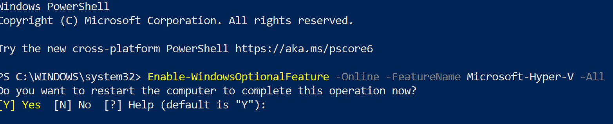
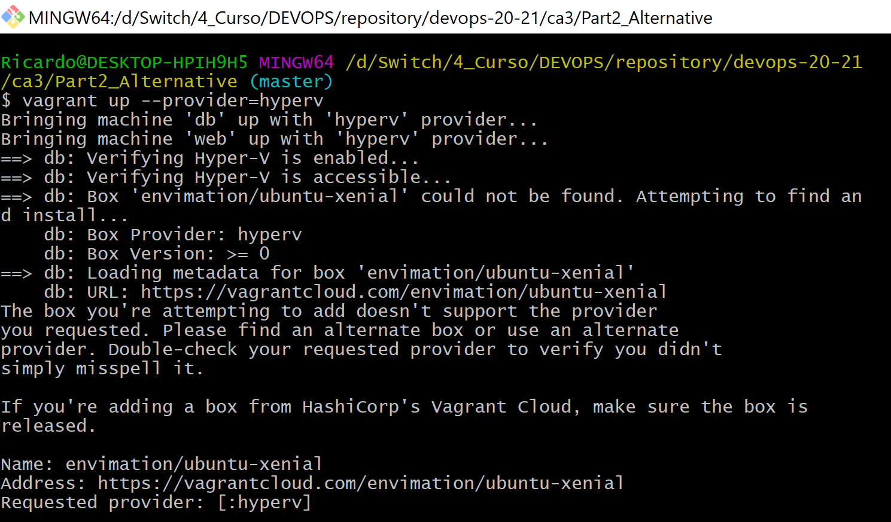
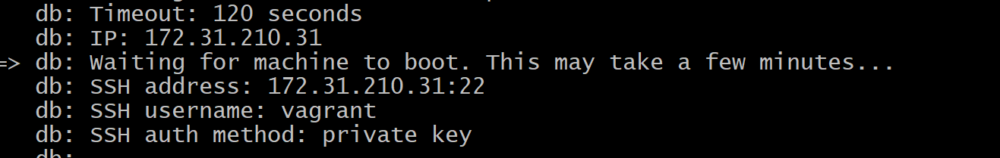
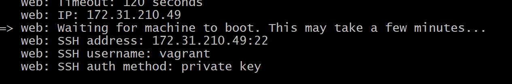
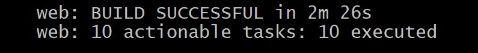
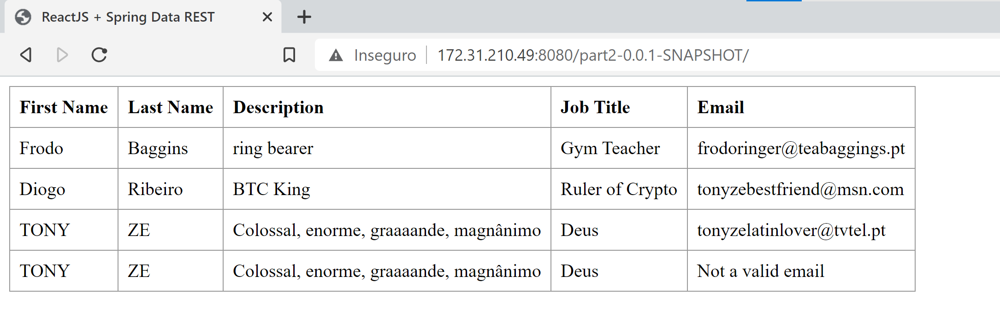
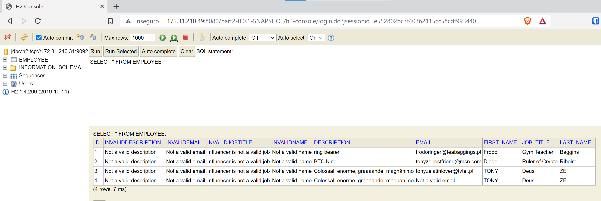

# Class Assignment 3 - Part 2 Alternative Implementation


# Virtual Box Alternative - Hyper-V

### Hello nerds! What's up?
### Long time, no see! 
### In this part we're going to take a look to a Virtual Box alternative.

This alternative is going to be _Hyper-V_! Hyper-V is a Windows native tool that allows the user to create and manage Virtual Machines.

Why Hyper-V? Well, first of all it's native to my OS so, no need for third-party software! 
Second, and still associated with the first, there is no need for search! Time is of the essence!

This way I will have spare time so I can look to Youtube tutorials on "How to build an industrial excavator using only toothpicks".

One other reason is that many of the Virtual Box alternatives are paid.

There are some free options but many of them have restrictions, like only allowing a single VM to be managed at a given time.

This would not allow for the completion of the Assignment.

But it's not all a _sea of roses_


One limitation that Hyper-V has, is the lack of fixed IP definition. 

This means the VM's IP's will be generated when they are initialized. 

This way, everytime we run the VMs, the _application.properties_ file has to be changed in order to match the DB VM's IP.

So, let's get things working.

### **Disclaimer** - As it was said before Hyper-V is native for Windows, so if you usually attend _Starbucks_ it's likely that you cannot perform this tutorial.

# 1. Install Hyper-V

**1.1.** You can use the Windows GUI to enable Hyper-V:


Or you can be a true Dev and use the command line.

In this case let's open Windows Power Shell as an administrator and install Hyper-V:



# 2. Create a copy of your project and paste the Vagrantfile previously used in CA3_Part2 in your working directory.

# 3. Build the Virtual Machine

**3.1.** In your working directory run the following command (You must have administrator rights in the command line):

```vagrant up --provider=hyperv```

If you are using the same Vagrant Box from the previous part of the assignment you should have the following error:



So, the next step is find a suitable box for Hyper-V. Go to https://app.vagrantup.com/boxes/search?provider=hyperv and pick your poison.

**3.2.** I'm going to pick the _bento/ubuntu-16.04_ and apply the changes to the Vagrantfile.

Replace your vm configurations in order to look like this:


```
Vagrant.configure("2") do |config|
config.vm.box = "bento/ubuntu-16.04"
config.vm.synced_folder ".", "/vagrant", disabled: true
```
Also, don't forget to substitute the "envimation/ubuntu-xenial" anywhere on the Vagrantfile, for _"bento/ubuntu-16.04"_

In order to avoid issues with shared folders (This will require usernames and passwords) the synced_folder was disabled.

**3.3.** Commit and push everything that is necessary to your repository and run the _vagrant up --provider=hyperv_ command again (Again, don't forget admin privileges)

**3.4.** You can take note of the VMs IP's during this process:

### DB VM


### web VM



Or you can be a simpleton and use the _Hyper-V_ GUI to obtain this information.


## **3.5.** Continuing with the VM's initialization

When it reaches this part I still get chills...


Luckily,


And it builds:



# 4. Let's see the table and the h2 console to see if everything is working:





Everything seems to be working fine!

## That's it! Thank you for keeping up through the storm. 

## Don't forget to use my discount code DEATH_TO_BAZEL-10 and join my Herbalife Team!